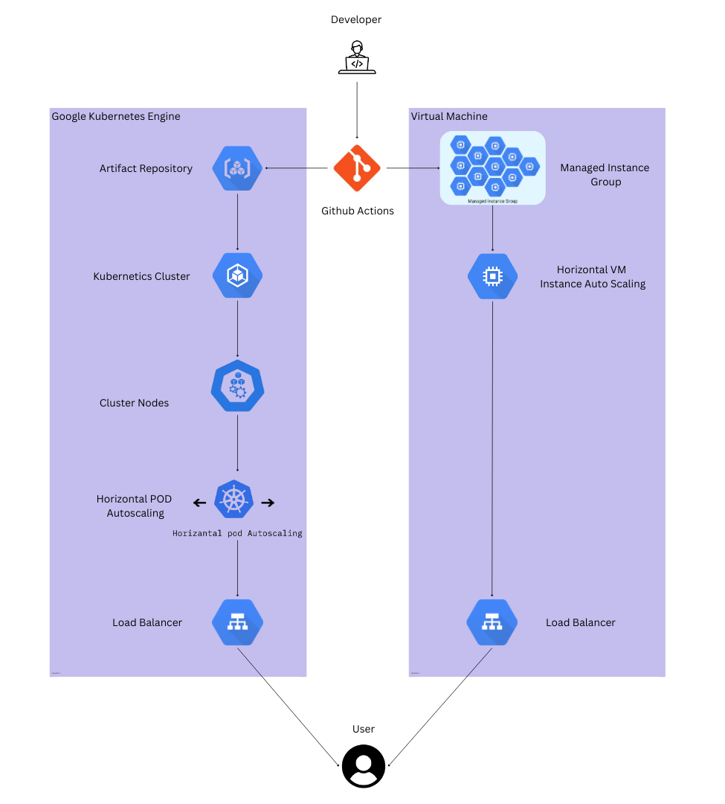

# Policy Summarizer & Deployment Setup
This repository contains the core files for the Policy Summarizer & Key Points Extractor project, which utilizes the BART model for summarization and TF-IDF for keyword extraction. It also includes deployment configurations for Docker and Google Kubernetes Engine (GKE) and in a VM instance group.This deployment model helps us find out which perform metrics between both the cloud options.   

## Contents

## Project Overview
- This project is designed to take legal or policy documents, summarize them using the BART model, and extract key points using TF-IDF. It can be deployed using Docker for local or cloud environments, or through GKE for scalable, cloud-based deployment.
    
## Process Flow

### tdf-bart.py
- This Python script contains the logic for summarizing policy documents using the BART model, alongside TF-IDF-based keyword extraction. It processes the input text by splitting it into manageable chunks, performing both abstractive and extractive summarization.

### Dockerfile
- The Dockerfile defines the environment setup for deploying the tdf-bart.py script. It includes the necessary dependencies and instructions to containerize the application for a consistent deployment experience.

### gke_deploy.yaml
- This Kubernetes configuration file is used to deploy the containerized application to Google Kubernetes Engine (GKE). It defines the service specifications, deployment settings, and resource allocations.

### Prerequisites
    - Python 3.7+ for running the summarization script locally.
    - Docker for containerizing the application. (Docker Desktop)
    - Google Cloud SDK for deploying to GKE.
    - Google Cloud API enabled for Kubernetics Engine, Artifact registry, Storage Admin -- https://cloud.google.com/kubernetes-engine/docs/how-to/service-accounts
    - Service account created with necessary role and key downloaded. -- https://cloud.google.com/iam/docs/keys-list-get
    - Secerts configured in github. -- https://docs.github.com/en/actions/security-for-github-actions/security-guides/using-secrets-in-github-actions

# Usage

## Running Locally

### Installing required Python Packages
 
    - pip install -r requirements.txt

### Execute the Python 
    - python tdf-bart.py

## Docker Setup 

### Build the Docker Image 
    - docker build -t policy-summarizer:latest .

### Run the Container 
    - docker run -p 8080:8080 policy-summarizer:latest

## Gke Deplpoyment

### GKE Architecture

### GKE Setup
 
For details about setting up the Google kubernetes Engine, refer to the [Google kubernetes Engine deployment](./gke-deployment/gcp_gke_deploy.md)

## VM Deployement

### MIG Architecture 

### GCP MIS Setup

For details about setting up the Google Cloud VM, refer to the [VM deployment](./gcp-vm-deployment/gcp_vm_deploy.md)

### Contributors

    Gayathri T (G23AI2012) - https://github.com/Gayathiriramalingam2024
    Jeyadev L (G23AI2071) - https://github.com/Jeyadev-2071 / https://github.com/Jeyadev42
    Bratati Rout (G23AI2074) - https://github.com/bratati-rout
    Devasree R (G23AI2078)- https://github.com/DevSr96
    